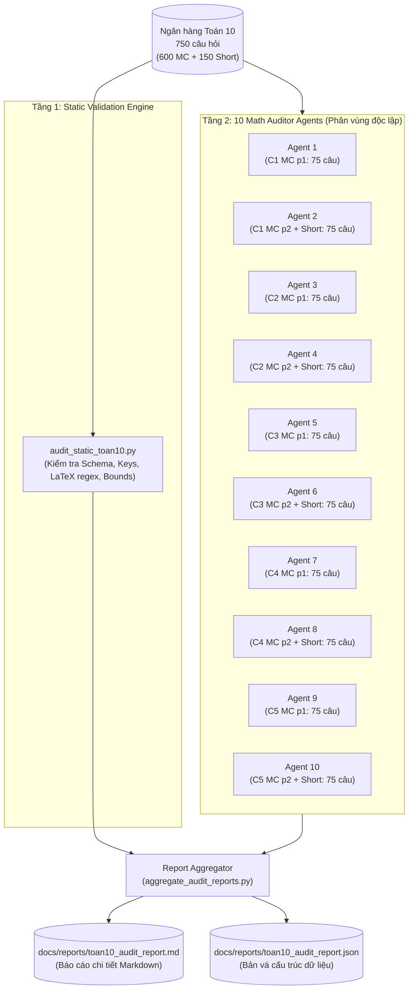

# Thiết kế Hệ thống Thẩm định 10 Agent cho Ngân hàng Câu hỏi Toán 10

**Ngày lập:** 2026-09-17  
**Phạm vi dữ liệu:** Môn Toán 10 (`data/toan10/questions/mc.json` & `short.json` — 750 câu hỏi)  
**Trạng thái:** Đã phê duyệt (Approved)

---

## 1. Tổng quan & Mục tiêu

Hệ thống ngân hàng câu hỏi Toán 10 gồm 750 câu hỏi (600 câu trắc nghiệm 4 lựa chọn và 150 câu trả lời ngắn) thuộc 5 chương theo chương trình GDPT 2018 (bộ Kết nối tri thức). 

Mục tiêu của hệ thống là triển khai mô hình kiểm định 2 tầng gồm **Bộ phân tích tĩnh (Static Validation Engine)** và **10 Chuyên viên Thẩm định Toán học độc lập (10 Math Auditor Agents)** để:
1. Đọc và rà soát 100% 750 câu hỏi, không bỏ sót câu nào.
2. Phát hiện chính xác mọi sai lệch về: nội dung toán học, tính hợp lý của đề bài, tính chính xác của đáp án, tính logic & chặt chẽ của lời giải, cú pháp hiển thị LaTeX và schema JSON.
3. Xuất báo cáo kiểm định toàn diện (Audit Report) kèm danh mục lỗi được phân cấp mức độ (Critical, Warning, Minor) cùng đề xuất sửa đổi cụ thể cho từng câu để người phụ trách rà duyệt trước khi áp dụng vào dữ liệu gốc.

---

## 2. Kiến trúc Hệ thống (2-Tier Hybrid Pipeline)

---

## 3. Phân chia Phân vùng cho 10 Agent (Agent Partitioning)

Tổng số câu hỏi: **750 câu**. Mỗi Agent phụ trách chính xác **75 câu**:

| Agent | Phạm vi kiểm tra | Chi tiết mã câu | Số lượng |
| :--- | :--- | :--- | :--- |
| **Agent 1** | Chương 1 (Mệnh đề & Tập hợp) - MC p1 | `mc-c1-001` → `mc-c1-075` | 75 câu |
| **Agent 2** | Chương 1 - MC p2 + Trả lời ngắn | `mc-c1-076` → `mc-c1-120` (45 câu) `short-c1-001` → `short-c1-030` (30 câu) | 75 câu |
| **Agent 3** | Chương 2 (Bất PT & Hệ bất PT bậc nhất 2 ẩn) - MC p1 | `mc-c2-001` → `mc-c2-075` | 75 câu |
| **Agent 4** | Chương 2 - MC p2 + Trả lời ngắn | `mc-c2-076` → `mc-c2-120` (45 câu) `short-c2-001` → `short-c2-030` (30 câu) | 75 câu |
| **Agent 5** | Chương 3 (Hệ thức lượng trong tam giác) - MC p1 | `mc-c3-001` → `mc-c3-075` | 75 câu |
| **Agent 6** | Chương 3 - MC p2 + Trả lời ngắn | `mc-c3-076` → `mc-c3-120` (45 câu) `short-c3-001` → `short-c3-030` (30 câu) | 75 câu |
| **Agent 7** | Chương 4 (Vectơ) - MC p1 | `mc-c4-001` → `mc-c4-075` | 75 câu |
| **Agent 8** | Chương 4 - MC p2 + Trả lời ngắn | `mc-c4-076` → `mc-c4-120` (45 câu) `short-c4-001` → `short-c4-030` (30 câu) | 75 câu |
| **Agent 9** | Chương 5 (Các số đặc trưng của mẫu số liệu) - MC p1 | `mc-c5-001` → `mc-c5-075` | 75 câu |
| **Agent 10** | Chương 5 - MC p2 + Trả lời ngắn | `mc-c5-076` → `mc-c5-120` (45 câu) `short-c5-001` → `short-c5-030` (30 câu) | 75 câu |
| **TỔNG** | **5 Chương** | **600 Trắc nghiệm + 150 Trả lời ngắn** | **750 câu** |

---

## 4. Bộ Tiêu chí Thẩm định & Phân cấp Mức độ Lỗi

Mỗi Agent duyệt câu hỏi theo 4 bộ lọc:
1. **Bộ lọc Đề bài (Soundness):** Đầy đủ giả thiết, không mâu thuẫn toán học, không viện dẫn "hình vẽ bên" khi không có ảnh đính kèm.
2. **Bộ lọc Đáp án (Correctness):**
   - Với trắc nghiệm: Chỉ số `answer` (0, 1, 2, 3) tương ứng duy nhất đáp án đúng; không có 2 đáp án trùng kết quả hoặc cùng đúng.
   - Với trả lời ngắn: Giá trị `answer` chính xác tuyệt đối hoặc đúng quy chuẩn làm tròn đã nêu trong đề.
3. **Bộ lọc Lời giải (Explanation):** Lời giải đi đúng trọng tâm, biến đổi logic toán học chính xác từng bước, kết luận ở cuối lời giải phải đồng nhất với đáp án đã chọn ở trường `answer`.
4. **Bộ lọc Hiển thị (LaTeX & Rendering):** Công thức toán được bao bọc đúng cặp `$..$`, không sót ký tự escape sai, không dùng lệnh TeX cũ làm hỏng parser.

### Phân cấp mức độ (Severity Taxonomy):
- 🔴 **CRITICAL:** Sai đáp án, đề bài sai/thiếu dữ kiện không thể giải, trùng đáp án đúng.
- 🟠 **WARNING:** Lời giải có bước nhầm lẫn nhỏ dù kết quả đúng; lỗi công thức LaTeX ảnh hưởng hiển thị.
- 🟡 **MINOR:** Lỗi chính tả, diễn đạt chưa mượt, lời giải cần làm rõ hơn.

---

## 5. Cấu trúc Báo cáo Đầu ra

- **Markdown Report:** `docs/reports/toan10_audit_report.md`
  - Bảng tổng kết số lượng câu đạt chuẩn / câu có lỗi.
  - Phân loại theo chương và theo cấp độ lỗi.
  - Nhật ký chi tiết từng lỗi (ID, nội dung hiện tại, phân tích nguyên nhân sai, phương án sửa đề xuất).
  - Bảng tiến độ và độ phủ của 10 Agent (đảm bảo đủ 750/750 câu).
- **JSON Structured Data:** `docs/reports/toan10_audit_report.json`
  - Danh sách có cấu trúc các lỗi để sau này có thể tự động sinh script vá dữ liệu nếu cần.
